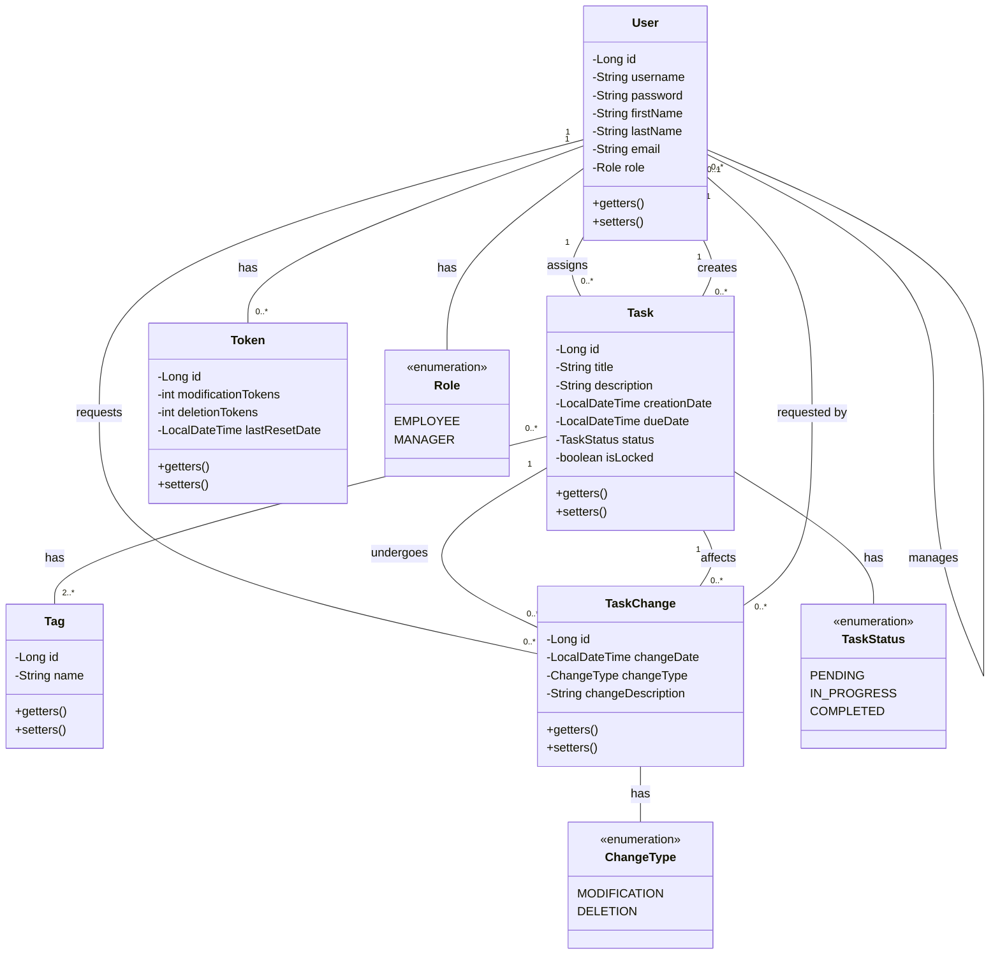

<p align="center">
  
</p>
<p align="center">
    <h1 align="center">DEVSYNCSS</h1>
</p>
<p align="center">
    <em><code>❯ REPLACE-ME</code></em>
</p>
<p align="center">
	
	
	
	
</p>
<p align="center">
		<em>Built with the tools and technologies:</em>
</p>
<p align="center">
	
</p>

<br>

##### 🔗 Table of Contents

- [📍 Overview](#-overview)
- [👾 Features](#-features)
- [📂 Repository Structure](#-repository-structure)
- [Conception](#-conception)
- [🧩 Modules](#-modules)
- [🚀 Getting Started](#-getting-started)
    - [🔖 Prerequisites](#-prerequisites)
    - [📦 Installation](#-installation)
    - [🤖 Usage](#-usage)
    - [🧪 Tests](#-tests)
- [🤝 Contributing](#-contributing)
- [🎗 License](#-license)
- [🙌 Acknowledgments](#-acknowledgments)

---

## 📍 Overview

<code>❯ REPLACE-ME</code>

---

## 👾 Features

<code>❯ REPLACE-ME</code>

---

## 📂 Repository Structure

```sh
└── DevSyncSS/
    ├── devsync-class-diagram.mermaid
    ├── pom.xml
    └── src
        └── main
```

---

## Conception

<details closed>
<summary>UML Class Diagram</summary>



</details>

---

## 🧩 Modules

<details closed><summary>.</summary>

| File | Summary |
| --- | --- |
| [devsync-class-diagram.mermaid](https://github.com/BENAMARLAHCEN/DevSyncSS/blob/main/devsync-class-diagram.mermaid) | <code>❯ REPLACE-ME</code> |

</details>

<details closed><summary>src.main.java.com.example.devsyncss.servlet</summary>

| File | Summary |
| --- | --- |
| [ProfileServlet.java](https://github.com/BENAMARLAHCEN/DevSyncSS/blob/main/src/main/java/com/example/devsyncss/servlet/ProfileServlet.java) | <code>❯ REPLACE-ME</code> |
| [UserServlet.java](https://github.com/BENAMARLAHCEN/DevSyncSS/blob/main/src/main/java/com/example/devsyncss/servlet/UserServlet.java) | <code>❯ REPLACE-ME</code> |
| [TaskServlet.java](https://github.com/BENAMARLAHCEN/DevSyncSS/blob/main/src/main/java/com/example/devsyncss/servlet/TaskServlet.java) | <code>❯ REPLACE-ME</code> |
| [DeleteProfileServlet.java](https://github.com/BENAMARLAHCEN/DevSyncSS/blob/main/src/main/java/com/example/devsyncss/servlet/DeleteProfileServlet.java) | <code>❯ REPLACE-ME</code> |
| [TaskBoardServlet.java](https://github.com/BENAMARLAHCEN/DevSyncSS/blob/main/src/main/java/com/example/devsyncss/servlet/TaskBoardServlet.java) | <code>❯ REPLACE-ME</code> |
| [ManagerChangeRequestsServlet.java](https://github.com/BENAMARLAHCEN/DevSyncSS/blob/main/src/main/java/com/example/devsyncss/servlet/ManagerChangeRequestsServlet.java) | <code>❯ REPLACE-ME</code> |

</details>

<details closed><summary>src.main.java.com.example.devsyncss.servlet.Authentication</summary>

| File | Summary |
| --- | --- |
| [LoginServlet.java](https://github.com/BENAMARLAHCEN/DevSyncSS/blob/main/src/main/java/com/example/devsyncss/servlet/Authentication/LoginServlet.java) | <code>❯ REPLACE-ME</code> |
| [RegisterServlet.java](https://github.com/BENAMARLAHCEN/DevSyncSS/blob/main/src/main/java/com/example/devsyncss/servlet/Authentication/RegisterServlet.java) | <code>❯ REPLACE-ME</code> |
| [LogoutServlet.java](https://github.com/BENAMARLAHCEN/DevSyncSS/blob/main/src/main/java/com/example/devsyncss/servlet/Authentication/LogoutServlet.java) | <code>❯ REPLACE-ME</code> |

</details>

<details closed><summary>src.main.java.com.example.devsyncss.entities</summary>

| File | Summary |
| --- | --- |
| [TaskChange.java](https://github.com/BENAMARLAHCEN/DevSyncSS/blob/main/src/main/java/com/example/devsyncss/entities/TaskChange.java) | <code>❯ REPLACE-ME</code> |
| [User.java](https://github.com/BENAMARLAHCEN/DevSyncSS/blob/main/src/main/java/com/example/devsyncss/entities/User.java) | <code>❯ REPLACE-ME</code> |
| [Tag.java](https://github.com/BENAMARLAHCEN/DevSyncSS/blob/main/src/main/java/com/example/devsyncss/entities/Tag.java) | <code>❯ REPLACE-ME</code> |
| [Token.java](https://github.com/BENAMARLAHCEN/DevSyncSS/blob/main/src/main/java/com/example/devsyncss/entities/Token.java) | <code>❯ REPLACE-ME</code> |
| [Task.java](https://github.com/BENAMARLAHCEN/DevSyncSS/blob/main/src/main/java/com/example/devsyncss/entities/Task.java) | <code>❯ REPLACE-ME</code> |

</details>

<details closed><summary>src.main.java.com.example.devsyncss.entities.enums</summary>

| File | Summary |
| --- | --- |
| [TaskStatus.java](https://github.com/BENAMARLAHCEN/DevSyncSS/blob/main/src/main/java/com/example/devsyncss/entities/enums/TaskStatus.java) | <code>❯ REPLACE-ME</code> |
| [ChangeType.java](https://github.com/BENAMARLAHCEN/DevSyncSS/blob/main/src/main/java/com/example/devsyncss/entities/enums/ChangeType.java) | <code>❯ REPLACE-ME</code> |
| [Role.java](https://github.com/BENAMARLAHCEN/DevSyncSS/blob/main/src/main/java/com/example/devsyncss/entities/enums/Role.java) | <code>❯ REPLACE-ME</code> |

</details>

<details closed><summary>src.main.java.com.example.devsyncss.scheduler</summary>

| File | Summary |
| --- | --- |
| [ChangeTaskScheduler.java](https://github.com/BENAMARLAHCEN/DevSyncSS/blob/main/src/main/java/com/example/devsyncss/scheduler/ChangeTaskScheduler.java) | <code>❯ REPLACE-ME</code> |
| [TaskScheduler.java](https://github.com/BENAMARLAHCEN/DevSyncSS/blob/main/src/main/java/com/example/devsyncss/scheduler/TaskScheduler.java) | <code>❯ REPLACE-ME</code> |
| [TokenScheduler.java](https://github.com/BENAMARLAHCEN/DevSyncSS/blob/main/src/main/java/com/example/devsyncss/scheduler/TokenScheduler.java) | <code>❯ REPLACE-ME</code> |

</details>

<details closed><summary>src.main.java.com.example.devsyncss.repository</summary>

| File | Summary |
| --- | --- |
| [TagRepository.java](https://github.com/BENAMARLAHCEN/DevSyncSS/blob/main/src/main/java/com/example/devsyncss/repository/TagRepository.java) | <code>❯ REPLACE-ME</code> |
| [TaskChangeRepository.java](https://github.com/BENAMARLAHCEN/DevSyncSS/blob/main/src/main/java/com/example/devsyncss/repository/TaskChangeRepository.java) | <code>❯ REPLACE-ME</code> |
| [TaskRepository.java](https://github.com/BENAMARLAHCEN/DevSyncSS/blob/main/src/main/java/com/example/devsyncss/repository/TaskRepository.java) | <code>❯ REPLACE-ME</code> |
| [UserRepository.java](https://github.com/BENAMARLAHCEN/DevSyncSS/blob/main/src/main/java/com/example/devsyncss/repository/UserRepository.java) | <code>❯ REPLACE-ME</code> |
| [TokenRepository.java](https://github.com/BENAMARLAHCEN/DevSyncSS/blob/main/src/main/java/com/example/devsyncss/repository/TokenRepository.java) | <code>❯ REPLACE-ME</code> |

</details>

<details closed><summary>src.main.java.com.example.devsyncss.repository.interfc</summary>

| File | Summary |
| --- | --- |
| [ITokenRepository.java](https://github.com/BENAMARLAHCEN/DevSyncSS/blob/main/src/main/java/com/example/devsyncss/repository/interfc/ITokenRepository.java) | <code>❯ REPLACE-ME</code> |
| [IUserRepository.java](https://github.com/BENAMARLAHCEN/DevSyncSS/blob/main/src/main/java/com/example/devsyncss/repository/interfc/IUserRepository.java) | <code>❯ REPLACE-ME</code> |
| [ITagRepository.java](https://github.com/BENAMARLAHCEN/DevSyncSS/blob/main/src/main/java/com/example/devsyncss/repository/interfc/ITagRepository.java) | <code>❯ REPLACE-ME</code> |
| [ITaskRepository.java](https://github.com/BENAMARLAHCEN/DevSyncSS/blob/main/src/main/java/com/example/devsyncss/repository/interfc/ITaskRepository.java) | <code>❯ REPLACE-ME</code> |
| [ITaskChangeRepository.java](https://github.com/BENAMARLAHCEN/DevSyncSS/blob/main/src/main/java/com/example/devsyncss/repository/interfc/ITaskChangeRepository.java) | <code>❯ REPLACE-ME</code> |

</details>

<details closed><summary>src.main.java.com.example.devsyncss.service</summary>

| File | Summary |
| --- | --- |
| [TokenService.java](https://github.com/BENAMARLAHCEN/DevSyncSS/blob/main/src/main/java/com/example/devsyncss/service/TokenService.java) | <code>❯ REPLACE-ME</code> |
| [TaskService.java](https://github.com/BENAMARLAHCEN/DevSyncSS/blob/main/src/main/java/com/example/devsyncss/service/TaskService.java) | <code>❯ REPLACE-ME</code> |
| [TagService.java](https://github.com/BENAMARLAHCEN/DevSyncSS/blob/main/src/main/java/com/example/devsyncss/service/TagService.java) | <code>❯ REPLACE-ME</code> |
| [TaskChangeRequestService.java](https://github.com/BENAMARLAHCEN/DevSyncSS/blob/main/src/main/java/com/example/devsyncss/service/TaskChangeRequestService.java) | <code>❯ REPLACE-ME</code> |
| [SchedulerService.java](https://github.com/BENAMARLAHCEN/DevSyncSS/blob/main/src/main/java/com/example/devsyncss/service/SchedulerService.java) | <code>❯ REPLACE-ME</code> |
| [UserService.java](https://github.com/BENAMARLAHCEN/DevSyncSS/blob/main/src/main/java/com/example/devsyncss/service/UserService.java) | <code>❯ REPLACE-ME</code> |

</details>

<details closed><summary>src.main.java.com.example.devsyncss.service.interfc</summary>

| File | Summary |
| --- | --- |
| [IUserService.java](https://github.com/BENAMARLAHCEN/DevSyncSS/blob/main/src/main/java/com/example/devsyncss/service/interfc/IUserService.java) | <code>❯ REPLACE-ME</code> |
| [ITagService.java](https://github.com/BENAMARLAHCEN/DevSyncSS/blob/main/src/main/java/com/example/devsyncss/service/interfc/ITagService.java) | <code>❯ REPLACE-ME</code> |
| [ITaskService.java](https://github.com/BENAMARLAHCEN/DevSyncSS/blob/main/src/main/java/com/example/devsyncss/service/interfc/ITaskService.java) | <code>❯ REPLACE-ME</code> |
| [ITaskChangeRequestService.java](https://github.com/BENAMARLAHCEN/DevSyncSS/blob/main/src/main/java/com/example/devsyncss/service/interfc/ITaskChangeRequestService.java) | <code>❯ REPLACE-ME</code> |
| [ITokenService.java](https://github.com/BENAMARLAHCEN/DevSyncSS/blob/main/src/main/java/com/example/devsyncss/service/interfc/ITokenService.java) | <code>❯ REPLACE-ME</code> |

</details>

<details closed><summary>src.main.webapp</summary>

| File | Summary |
| --- | --- |
| [index.jsp](https://github.com/BENAMARLAHCEN/DevSyncSS/blob/main/src/main/webapp/index.jsp) | <code>❯ REPLACE-ME</code> |
| [manager-change-requests.jsp](https://github.com/BENAMARLAHCEN/DevSyncSS/blob/main/src/main/webapp/manager-change-requests.jsp) | <code>❯ REPLACE-ME</code> |
| [users.jsp](https://github.com/BENAMARLAHCEN/DevSyncSS/blob/main/src/main/webapp/users.jsp) | <code>❯ REPLACE-ME</code> |
| [edit-task.jsp](https://github.com/BENAMARLAHCEN/DevSyncSS/blob/main/src/main/webapp/edit-task.jsp) | <code>❯ REPLACE-ME</code> |
| [login.jsp](https://github.com/BENAMARLAHCEN/DevSyncSS/blob/main/src/main/webapp/login.jsp) | <code>❯ REPLACE-ME</code> |
| [profile.jsp](https://github.com/BENAMARLAHCEN/DevSyncSS/blob/main/src/main/webapp/profile.jsp) | <code>❯ REPLACE-ME</code> |
| [tasks-board.jsp](https://github.com/BENAMARLAHCEN/DevSyncSS/blob/main/src/main/webapp/tasks-board.jsp) | <code>❯ REPLACE-ME</code> |
| [edit-user.jsp](https://github.com/BENAMARLAHCEN/DevSyncSS/blob/main/src/main/webapp/edit-user.jsp) | <code>❯ REPLACE-ME</code> |
| [register.jsp](https://github.com/BENAMARLAHCEN/DevSyncSS/blob/main/src/main/webapp/register.jsp) | <code>❯ REPLACE-ME</code> |
| [tasks.jsp](https://github.com/BENAMARLAHCEN/DevSyncSS/blob/main/src/main/webapp/tasks.jsp) | <code>❯ REPLACE-ME</code> |

</details>

<details closed><summary>src.main.webapp.shared</summary>

| File | Summary |
| --- | --- |
| [_alert.jsp](https://github.com/BENAMARLAHCEN/DevSyncSS/blob/main/src/main/webapp/shared/_alert.jsp) | <code>❯ REPLACE-ME</code> |
| [_header.jsp](https://github.com/BENAMARLAHCEN/DevSyncSS/blob/main/src/main/webapp/shared/_header.jsp) | <code>❯ REPLACE-ME</code> |
| [_nav.jsp](https://github.com/BENAMARLAHCEN/DevSyncSS/blob/main/src/main/webapp/shared/_nav.jsp) | <code>❯ REPLACE-ME</code> |

</details>

---

## 🚀 Getting Started

### 🔖 Prerequisites

**Java**: `version x.y.z`

### 📦 Installation

Build the project from source:

1. Clone the DevSyncSS repository:
```sh
❯ git clone https://github.com/BENAMARLAHCEN/DevSyncSS
```

2. Navigate to the project directory:
```sh
❯ cd DevSyncSS
```

3. Install the required dependencies:
```sh
❯ mvn clean install
```

### 🤖 Usage

To run the project, execute the following command:

```sh
❯ java -jar target/myapp.jar
```

### 🧪 Tests

Execute the test suite using the following command:

```sh
❯ mvn test
```


## 🤝 Contributing

Contributions are welcome! Here are several ways you can contribute:

- **[Report Issues](https://github.com/BENAMARLAHCEN/DevSyncSS/issues)**: Submit bugs found or log feature requests for the `DevSyncSS` project.
- **[Submit Pull Requests](https://github.com/BENAMARLAHCEN/DevSyncSS/blob/main/CONTRIBUTING.md)**: Review open PRs, and submit your own PRs.
- **[Join the Discussions](https://github.com/BENAMARLAHCEN/DevSyncSS/discussions)**: Share your insights, provide feedback, or ask questions.

<details closed>
<summary>Contributing Guidelines</summary>

1. **Fork the Repository**: Start by forking the project repository to your github account.
2. **Clone Locally**: Clone the forked repository to your local machine using a git client.
   ```sh
   git clone https://github.com/BENAMARLAHCEN/DevSyncSS
   ```
3. **Create a New Branch**: Always work on a new branch, giving it a descriptive name.
   ```sh
   git checkout -b new-feature-x
   ```
4. **Make Your Changes**: Develop and test your changes locally.
5. **Commit Your Changes**: Commit with a clear message describing your updates.
   ```sh
   git commit -m 'Implemented new feature x.'
   ```
6. **Push to github**: Push the changes to your forked repository.
   ```sh
   git push origin new-feature-x
   ```
7. **Submit a Pull Request**: Create a PR against the original project repository. Clearly describe the changes and their motivations.
8. **Review**: Once your PR is reviewed and approved, it will be merged into the main branch. Congratulations on your contribution!
</details>

<details closed>
<summary>Contributor Graph</summary>
<br>
<p align="left">
   <a href="https://github.com{/BENAMARLAHCEN/DevSyncSS/}graphs/contributors">
      
   </a>
</p>
</details>

---

## 🎗 License

This project is protected under the [SELECT-A-LICENSE](https://choosealicense.com/licenses) License. For more details, refer to the [LICENSE](https://choosealicense.com/licenses/) file.

---

## 🙌 Acknowledgments

- List any resources, contributors, inspiration, etc. here.

---
